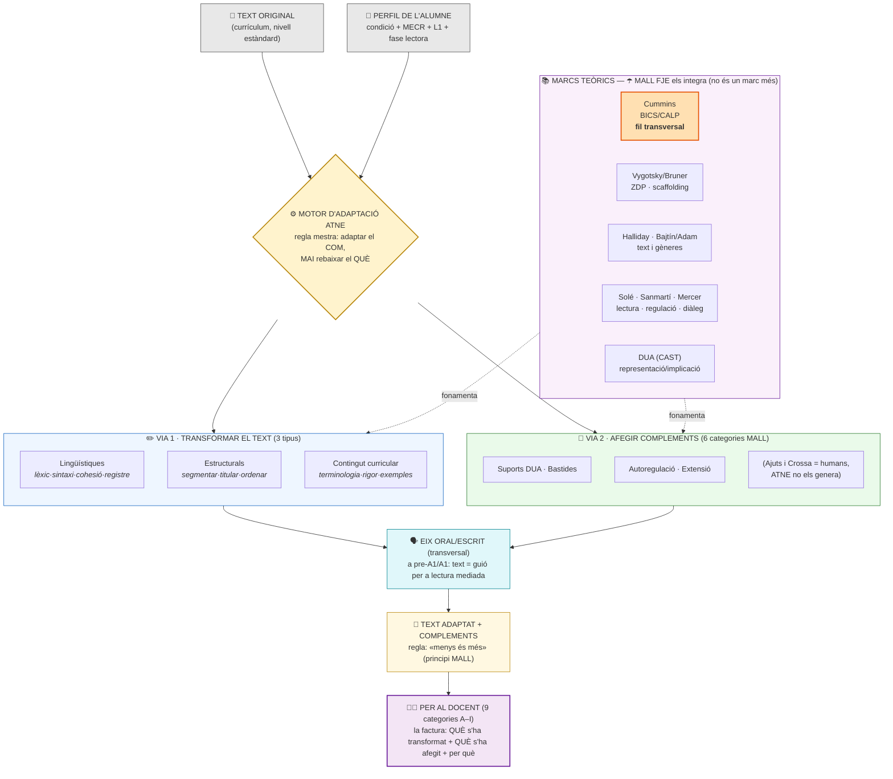
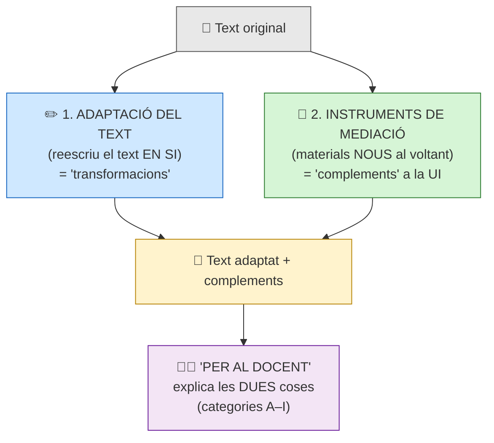
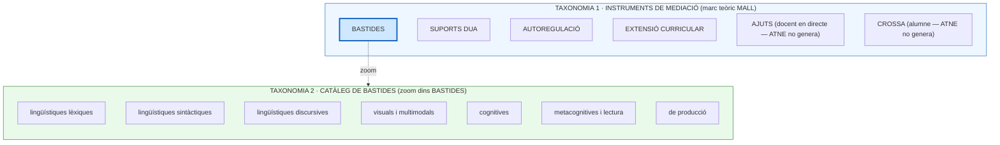
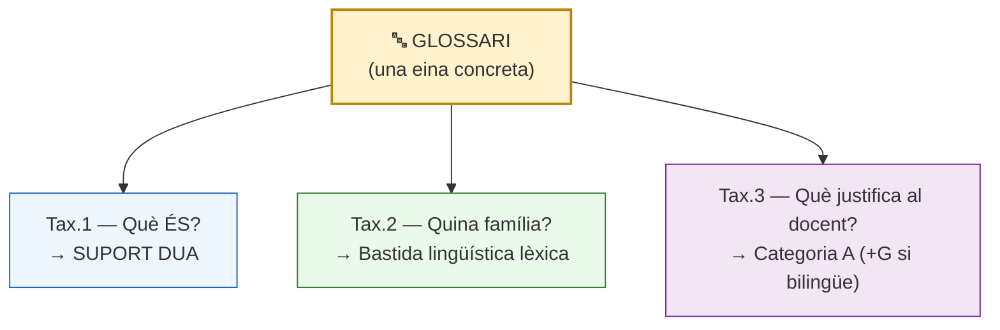
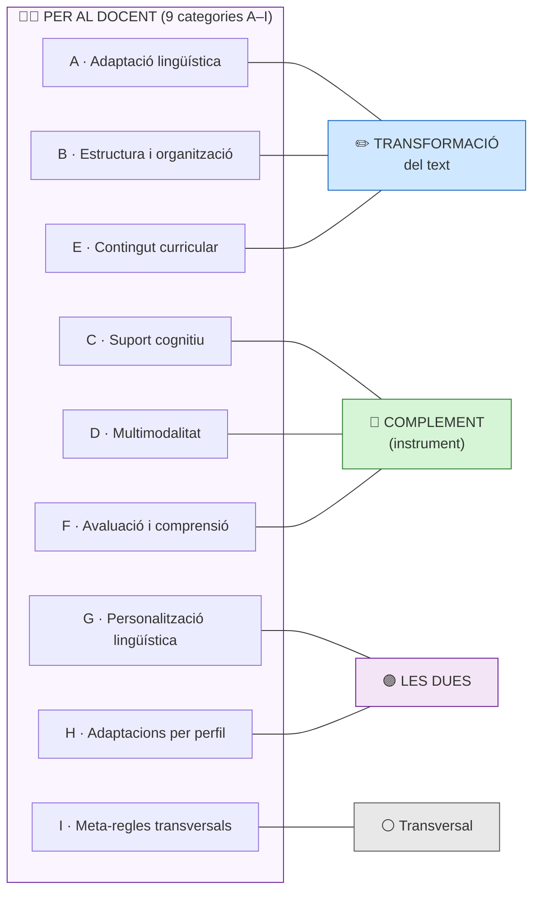
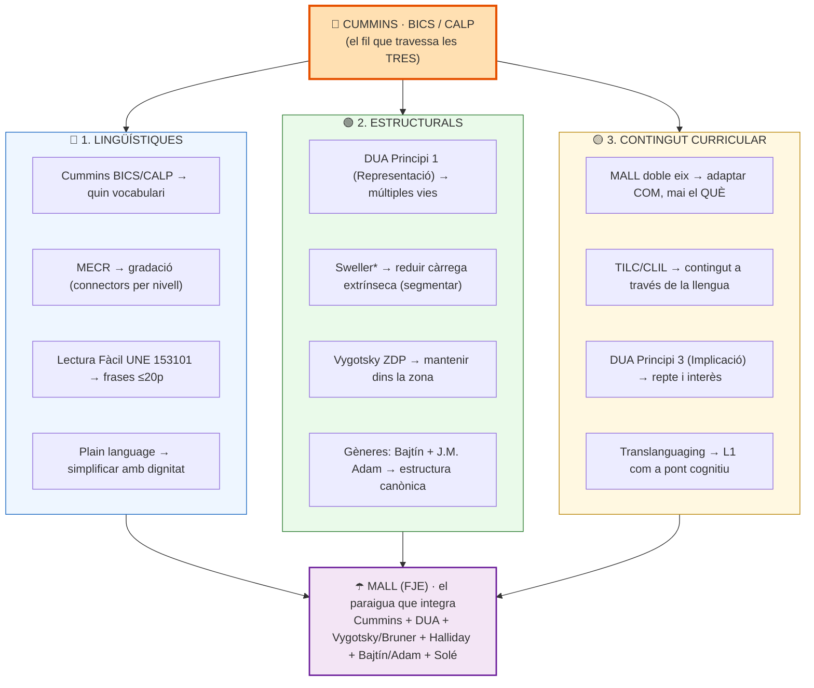
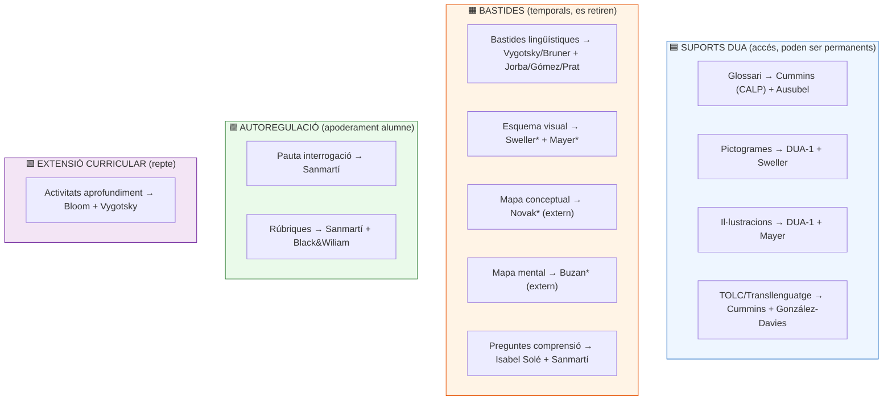
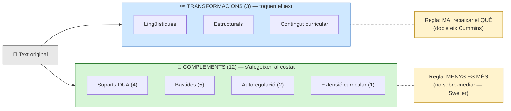

# Mapa visual de les taxonomies d'ATNE

## Diagrama 0 — SÍNTESI: com s'integra tot i com adaptem (flux teòric complet)

> El diagrama-resum. Mostra el procés sencer d'una adaptació ATNE de principi a fi,
> amb els marcs teòrics que fonamenten cada decisió. La resta de diagrames (1-7) en
> despleguen les peces. Renderitzat a `mapa_teoric_adaptacio.png`.

---

## Diagrama 1 — Les dues coses que fem quan adaptem

---

## Diagrama 2 — Les tres taxonomies i com es creuen

---

## Diagrama 3 — Una eina viu a les TRES taxonomies alhora (el creuament)

---

## Diagrama 4 — "Per al docent" (A–I): què és transformació i què és complement

---

## Diagrama 5 — L'origen teòric de les 3 transformacions

> Cap transformació "pertany" a un sol marc: cada una INTEGRA diversos marcs.
> Cummins (BICS/CALP) travessa les tres. MALL (FJE) és el paraigua que ho embolcalla tot.

---

## Taula resum — Transformació × Marc teòric

| Transformació | Marc DOMINANT | Marcs que hi aporten |
|---|---|---|
| 🔵 **Lingüístiques** | Cummins (BICS/CALP) | MECR · Lectura Fàcil (UNE 153101)* · Plain language · Halliday (LSF) · MALL P3+P5 |
| 🟢 **Estructurals** | DUA-1 + Sweller* | Vygotsky ZDP · Bruner scaffolding · gèneres discursius (Bajtín + J.M. Adam) · Camps/Zayas (seqüència didàctica) |
| 🟡 **Contingut curricular** | MALL "doble eix" / Cummins | TILC/CLIL · DUA-3 · Translanguaging · 5 HCL (Jorba/Sanmartí) |

> \* **Nota de validació NotebookLM (corpus MALL):** Sweller, Ausubel i la norma UNE 153101
> NO són citats nominalment al corpus MALL — el CONCEPTE hi és (càrrega cognitiva,
> organitzador previ, accessibilitat) però l'autor/norma no. Atribucions externes legítimes,
> però marcades com a tals.

**Claus de lectura:**
- **Cummins (BICS/CALP)** és el fil transversal: a la lingüística tria el vocabulari, a l'estructural sosté l'scaffolding, al contingut és el "doble eix" (mai rebaixar el QUÈ). ✅ *confirmat NotebookLM*
- **MALL** NO és un marc paral·lel: és el **paraigua institucional FJE** que integra tots els altres. ✅ *confirmat NotebookLM: "síntesi integradora de marcs consolidats"*
- **DUA** apareix a dues transformacions amb principis diferents: P1 (Representació) a l'estructural, P3 (Implicació) al contingut.
- ⚠️ **Gèneres = Bajtín (esferes d'activitat) + J.M. Adam (seqüències textuals)**, NO Gibbons (correcció NotebookLM).
- 🔴 **MARC ABSENT (pendent): el PILAR DE L'ORALITAT.** El MALL considera l'oralitat el fonament de tot aprenentatge lingüístic. Falta una 4a transformació possible: **text → guió oral** (lectura mediada) per a pre-A1/A1. Candidat a futur.

---

## Diagrama 6 — Els 12 complements per categoria MALL

> A diferència de les transformacions (origen difús), cada complement té un teòric "pare" nítid.

---

## Diagrama 7 — La simetria: transformacions vs complements

---

## Taula resum — Complement × Categoria MALL × Teòric pare

| Complement | Categoria MALL | Teòric pare | Estat | Validació NotebookLM |
|---|---|---|---|---|
| Glossari | Suport DUA | Cummins (CALP) + Ausubel* | ✅ | ✅ correcte (Ausubel no citat nominalment) |
| Pictogrames | Suport DUA | DUA-1 + Sweller* | ✅ | ✅ molt coherent |
| Il·lustracions | Suport DUA | DUA-1 + Mayer* | ✅ (beta) | ✅ molt coherent |
| TOLC/Transllenguatge | Suport DUA | Cummins + González-Davies + Corcoll | 🔲 parcial | ✅ **exacta** |
| Bastides lingüístiques | Bastida | Vygotsky/Bruner + Jorba/Gómez/Prat | ✅ | ✅ **exacta** |
| Esquema visual | Bastida cognitiva | Sweller* + Mayer* | ✅ | ✅ coherent |
| Mapa conceptual | Bastida cognitiva | Novak* (extern) | ✅ | ⚠️ MALL NO anomena Novak |
| Mapa mental | Bastida cognitiva | Buzan* (extern) | ✅ | ⚠️ MALL NO anomena Buzan |
| Preguntes comprensió | Bastida metacognitiva | **Isabel Solé** + Sanmartí | ✅ | ⚠️ faltava Solé (referent lectura) |
| Pauta d'interrogació | Autoregulació | Sanmartí | ✅ (checklist) | ✅ **confirmat** |
| Rúbriques | Autoregulació | Sanmartí + Black & Wiliam + DUA-3 | 🔲 | ✅ coherent |
| Activitats aprofundiment | Extensió curricular | Bloom + Vygotsky | ✅ | ✅ coherent |
| Plantilles de gènere | Bastida discursiva | Bajtín + J.M. Adam + TILC | 🔲 | (gèneres = Bajtín/Adam) |
| Resum graduat | Bastida cognitiva | Sweller* (complexitat progressiva) | 🔲 | — |
| Cartes conversacionals | Bastida de producció | MALL + Vygotsky | 🔲 | — |

> \* **No citats nominalment al corpus MALL** (Sweller, Ausubel, Mayer, Novak, Buzan): el CONCEPTE
> hi és, l'autor no. Atribucions externes legítimes però marcades. Veredicte NotebookLM: mapeig
> **"excel·lent, especialment en Suports DUA i Autoregulació"**.

**Claus de lectura:**
- **DUA + Sweller** són el fil transversal dels complements (com Cummins ho era de les transformacions).
- Cada complement té un teòric pare clar, PERÒ atenció: **Novak (mapa conceptual) i Buzan (mapa mental) NO són citats pel MALL** — són atribucions externes nostres (la disciplina els reconeix, però el corpus FJE no els nomena).
- **Preguntes de comprensió: el referent principal de la LECTURA és Isabel Solé** (3 moments), reforçada per Sanmartí (regulació). Correcció NotebookLM.
- La regla mestra dels complements és **"menys és més"**: la matriu proposa 2-3 per condició, no tots. ✅ *Principi PROPI del MALL (font: "6-10 preguntes totals. Mai més."). Convergeix amb la càrrega cognitiva de Sweller, però el MALL no el cita — convergència externa, no fonament (canonitzat a M2_marc-teoric-mediacio.md).*
- 🔴 **Teòrics que el MALL SÍ cita i caldria integrar:** Halliday (LSF), Camps/Zayas (seqüència didàctica), Bajtín (gèneres).
